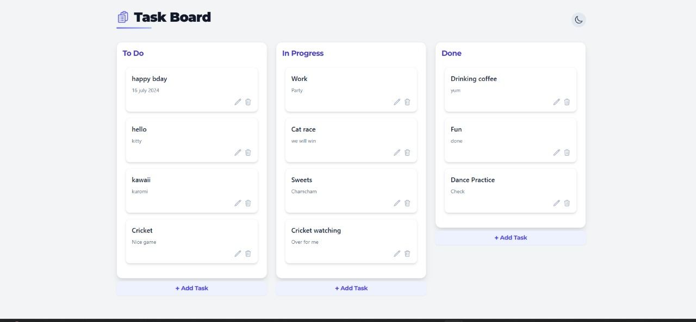
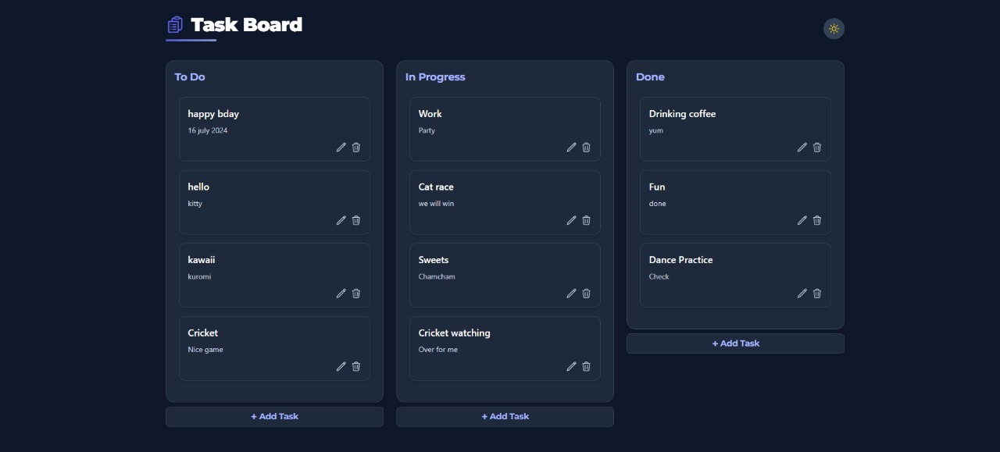

# Task Board

A modern, fullstack task management board inspired by Trello. Built with React (Vite, Tailwind CSS) and FastAPI (Python, SQLite).

---

## ✨ Features

- 📝 Drag-and-drop task management (move and reorder tasks between columns)
- ➕ Create, edit, and delete tasks
- 💾 Persistent storage with SQLite
- 🌗 Light and dark mode toggle
- 📱 Responsive, professional UI

---

## 🛠️ Tech Stack

- **Frontend:** React, Vite, Tailwind CSS, react-beautiful-dnd
- **Backend:** FastAPI, SQLite, SQLAlchemy

---

## 🚀 Setup Instructions

### 1. Clone the Repository

```bash
git clone https://github.com/YOUR_USERNAME/task-board.git
cd task-board
```

### 2. Backend Setup

```bash
cd backend
python -m venv venv
# On Windows:
venv\Scripts\activate
# On Mac/Linux:
source venv/bin/activate

pip install -r requirements.txt
uvicorn main:app --reload
```
- The backend will run at `http://localhost:8000`

### 3. Frontend Setup

Open a new terminal, then:

```bash
cd frontend
npm install
npm run dev
```
- The frontend will run at `http://localhost:5173`

---

## 🌍 Deployment

- **Frontend:** Deploy the `frontend` folder to [Vercel](https://vercel.com/) or [Netlify](https://www.netlify.com/)
- **Backend:** Deploy the `backend` folder to [Render](https://render.com/), [Railway](https://railway.app/), or [Fly.io](https://fly.io/)

**Live Demo:** [YOUR_LIVE_LINK_HERE](#)

---

## 📸 Screenshots




---

## 📄 License

MIT

---

## 🙏 Credits

- [React](https://react.dev/)
- [Vite](https://vitejs.dev/)
- [Tailwind CSS](https://tailwindcss.com/)
- [FastAPI](https://fastapi.tiangolo.com/)
- [react-beautiful-dnd](https://github.com/atlassian/react-beautiful-dnd) 
